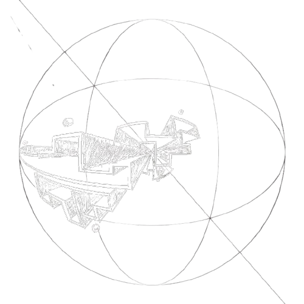
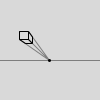
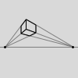
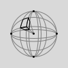

<!-- Improved compatibility of back to top link: See: https://github.com/othneildrew/Best-README-Template/pull/73 -->

[![GPL-2.0 License][license-shield]][license-url]

<!-- PROJECT LOGO -->
 

  

  <h1 align="center">5 Point Perspective Sketching</h1>

  

    An Etch-A-Sketch inspired canvas for drawing in 5 point perspective.
     
    <a href="https://precisshley.github.io/5pointperspective/"><strong>Visit the Demo »</strong></a>
     
     
  

<!-- TABLE OF CONTENTS -->

  
Table of Contents

  <ol>
    <li>
      <a href="#about-the-project">About The Project</a>
      <ul>
        <li><a href="#built-with">Built With</a></li>
      </ul>
    </li>
    <li>
      <a href="#getting-started">Getting Started</a>
    </li>
    <li><a href="#usage">Usage</a></li>
    <li><a href="#license">License</a></li>
  </ol>

<!-- ABOUT THE PROJECT -->
## About The Project

For a couple years when I was doodling I would play around with drawing in 5 point perspective. If you've heard of drawing in 1-point or 2-point perspective, it's the same idea: Points on the page represent different axes. Choose a spot on the page and draw lines towards the appropriate vanishing points. The key difference is that in 5-point perspective, lines curve along the x and y axes:

  

    
     
    One Point
  

  

    
     
    Two Points
  

  

    
     
    5 Points
  

As you may have noticed, compared to 1 and 2 points, 5 points can get a little overwhelming. I was getting tired of sketching out all those guidelines by hand and running out of erasers. That's why I made this program.

### Built With

 [![p5.js][p5.js]][p5-url]
 [![JavaScript][JavaScript]][js-url]
 [![HTML5][HTML5]][html-url]
 [![CSS3][CSS3]][css-url]

<!-- GETTING STARTED -->
## Getting Started

Not much to it, either run index.html locally or visit the <a href="https://precisshley.github.io/5pointperspective/">live page</a>.

<!-- USAGE EXAMPLES -->
## Usage

While drawing on the canvas there are three guide lines you can lock onto: 
* The x-axis ellipse stretching the width of the circle.
* The y-axis ellipse stretching the height of the circle.
* The z-line pointing to the center of the canvas.

Hold down the x,y, or z keys and begin drawing. You will see a line drawn along the selected axis.
These key bindings can be adjusted along with a few others:
* l key: Switch between light and dark mode (inverts canvas colour)
* r key: Resets the canvas
* h key: Toggles guideline visibility

<!-- LICENSE -->
## License

Distributed under the GNU General Public License v2.0. See `LICENSE.txt` for more information.

(<a href="#readme-top">back to top</a>)

<!-- MARKDOWN LINKS & IMAGES -->
<!-- https://www.markdownguide.org/basic-syntax/#reference-style-links -->
[license-shield]: https://img.shields.io/badge/License-GPL%202.0-blue.svg?style=for-the-badge
[license-url]: https://www.gnu.org/licenses/old-licenses/gpl-2.0.html

[p5.js]: https://img.shields.io/badge/p5.js-FFFFFF?style=for-the-badge&logo=p5.js&logoColor=FFFFFF
[p5-url]: https://p5js.org/

[JavaScript]: https://img.shields.io/badge/JavaScript-F7DF1E?style=for-the-badge&logo=javascript&logoColor=000000
[js-url]: https://developer.mozilla.org/en-US/docs/Web/JavaScript

[HTML5]: https://img.shields.io/badge/HTML5-E34F26?style=for-the-badge&logo=html5&logoColor=FFFFFF
[html-url]: https://developer.mozilla.org/en-US/docs/Web/HTML

[CSS3]: https://img.shields.io/badge/CSS3-2965F1?style=for-the-badge&logo=css3&logoColor=FFFFFF
[css-url]: https://developer.mozilla.org/en-US/docs/Web/CSS
